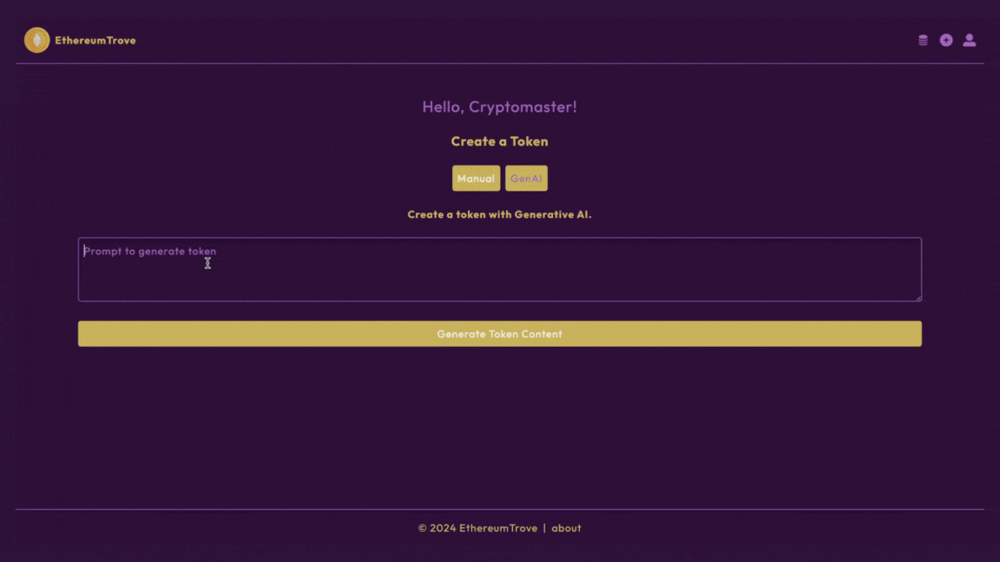

# ERC-20-Frontend
ERC-20-Frontend

This repository hosts a full-stack application with the Next.js framework to connect to a smart contract that allows users to transfer ERC-20 tokens as well as create and mint custom ERC-20 tokens. It works in conjuction with an external <a href="https://github.com/thelearner411/ERC-20-Backend" target="_blank">smart contract</a>.

## Instructions for running this application

Install <a href="https://metamask.io/download/" target="_blank">MetaMask</a> in your browser.

Install <a href="https://archive.trufflesuite.com/ganache/" target="_blank">Ganache</a>.

First run the <a href="https://github.com/thelearner411/ERC-20-Backend" target="_blank">backend</a> of this application where the smart contract is deployed.

Clone a fork of this <a href="https://github.com/thelearner411/ERC-20-Frontend" target="_blank">repository</a> to your local device.

Enter the application directory with the command: cd erc-20-app

Create a .env file with the following variables:

OPENAI_API_KEY = An Open AI API key that you can get <a href="https://platform.openai.com/api-keys" target="_blank">here</a>.

NEXT_PUBLIC_WEB3_ADDRESS = Host of your local ganache where the smart contract is running.

NEXT_PUBLIC_TOKEN_CONTRACT_ADDRESS= Contract address of your smart contract.

Run the following command to install all dependencies: npm install

Run the following command to run the application: npm run dev

## Generative AI Applied to ERC-20

This project uses the OpenAI APIs, namely the gpt-3.5-turbo-0125 and dall-e-3 models, to generate content for a new custom token. The user may enter a prompt and have token content genrated including the token name, symbol and logo image.

  

